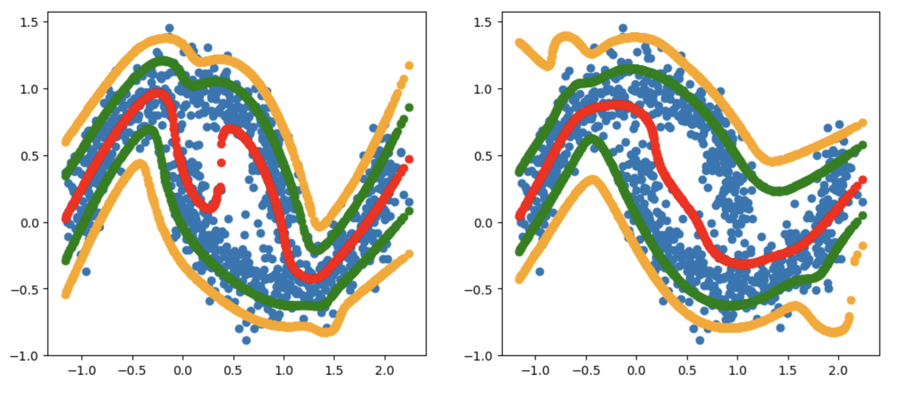

---
hide:
  - navigation
---

# scikit-mdn

> Mixture density networks, from PyTorch, for scikit-learn

## Usage

To get this tool working locally you will first need to install it:

```bash
python -m pip install scikit-mdn
```

Then you can use it in your code. Here is a small demo example.

```python
import numpy as np
from sklearn.datasets import make_moons
from skmdn import MixtureDensityEstimator

# Generate dataset
n_samples = 1000
X_full, _ = make_moons(n_samples=n_samples, noise=0.1)
X = X_full[:, 0].reshape(-1, 1)  # Use only the first column as input
Y = X_full[:, 1].reshape(-1, 1)  # Predict the second column

# Add some noise to Y to make the problem more suitable for MDN
Y += 0.1 * np.random.randn(n_samples, 1)

# Fit the model
mdn = MixtureDensityEstimator()
mdn.fit(X, Y)

# Predict some quantiles on the train set 
means, quantiles = mdn.predict(X, quantiles=[0.01, 0.1, 0.9, 0.99], resolution=100000)
```

This is what the chart looks like:


You can see how it is able to predict the quantiles of the distribution, and the mean.

## Regularisation 

There is a `weight_decay` parameter that will allow you to apply regularisation on the weights. On the moons example the effect of this is pretty clear. 



## API

This is the main object that you'll interact with. 

::: skmdn.MixtureDensityEstimator
    handler: python
    options:
        heading_level: 4
        show_symbol_type_toc: true